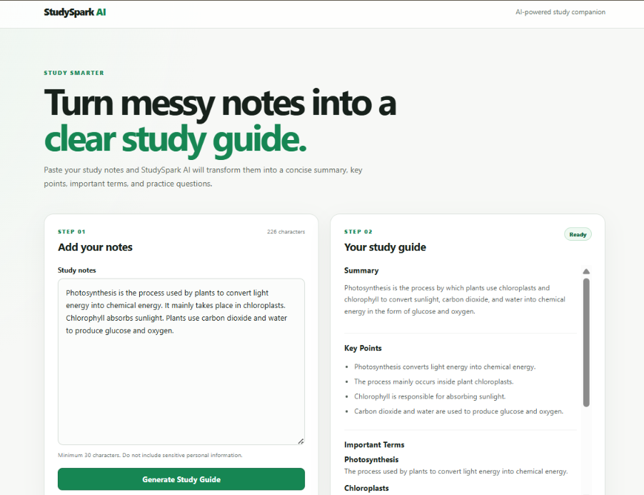
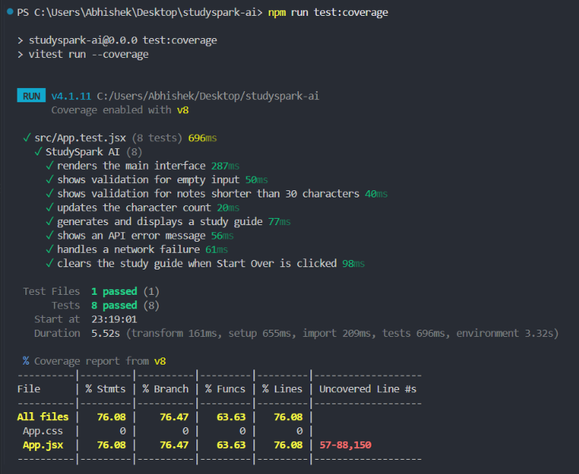
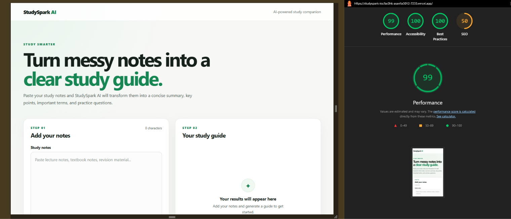

# StudySpark AI

StudySpark AI is an accessible AI-powered study assistant that transforms raw study notes into structured revision material.

Users can paste lecture notes, textbook content, or revision material and generate a concise study guide containing a summary, key points, important terms, and practice questions.

## Problem

Students often have large amounts of unstructured notes and limited time to organize them for revision. Manually creating summaries, extracting important concepts, and writing practice questions can be repetitive and time-consuming.

StudySpark AI uses generative AI to turn raw notes into a structured study guide in seconds.

## Target Users

The application is designed primarily for students who want a quick and simple way to organize study material for revision.

## Features

- AI-generated summaries
- Key point extraction
- Important term identification
- Practice question generation
- Structured AI responses
- Loading state during generation
- Empty input validation
- Minimum input validation
- AI and network error handling
- Copy study guide functionality
- Start over functionality
- Responsive interface
- Keyboard-accessible controls
- Accessible labels and status messages
- Reduced-motion support

## Tech Stack

- React
- Vite
- JavaScript
- CSS
- Gemini API
- Vercel Serverless Functions
- Vitest
- React Testing Library

## AI Integration

StudySpark AI uses Google's Gemini model through a server-side API endpoint.

The frontend sends the user's notes to `/api/generate`. The serverless function creates an educational prompt and requests a structured JSON response from Gemini.

The expected response contains:

- `summary`
- `keyPoints`
- `terms`
- `questions`

The server validates the response before returning it to the frontend.

The Gemini API key is stored as a server-side environment variable and is never exposed in frontend source code.

## Accessibility

Accessibility was considered throughout the interface.

The application includes:

- Semantic HTML elements
- Proper form labels
- Accessible headings
- Keyboard accessible controls
- Visible focus indicators
- ARIA live regions for status updates
- `aria-busy` during AI generation
- Sufficient color contrast
- Responsive layouts
- Reduced-motion support

## Error Handling

The application handles several failure scenarios including:

- Empty input
- Input shorter than the required minimum
- Missing API configuration
- AI service failure
- Empty AI responses
- Invalid JSON responses
- Missing structured response fields
- Clipboard failures
- Network errors

Users receive readable error messages rather than raw technical errors.

## Testing

Component tests are implemented with Vitest and React Testing Library.

The tests verify that important interface elements render correctly, including:

- Main application heading
- Study notes textarea
- Generate Study Guide button

Run the tests with:

```bash
npm test
```

## Testing and Build

Run linting with:

```bash
npm run lint
```

Create a production build with:

```bash
npm run build
```

## Running Locally

Clone the repository and install dependencies:

```bash
npm install
```

Create a `.env` file in the project root and add:

```env
GEMINI_API_KEY=your_gemini_api_key
```

Start the frontend development server:

```bash
npm run dev
```

For the local Express API, run:

```bash
node server/server.js
```

## Environment Variables

The project requires the following environment variable:

```env
GEMINI_API_KEY
```

The real `.env` file is excluded from version control to prevent secret credentials from being committed.

An `.env.example` file documents the required environment variable without exposing the actual API key.

Example:

```env
GEMINI_API_KEY=your_gemini_api_key
```

## Deployment

The production application is deployed using Vercel.

The React application is built using Vite, while the Gemini integration is handled by a Vercel serverless function located at:

```text
/api/generate
```

The `GEMINI_API_KEY` environment variable is configured securely in the Vercel project settings and is never exposed in the frontend code.

## Deployment Checklist

### Before Deployment

* Tests pass
* ESLint passes
* Production build succeeds
* `.env` is excluded from Git
* API key is stored as an environment variable
* AI response validation is enabled
* Error states are implemented
* Responsive layout is verified
* Keyboard interaction is verified

### After Deployment

* Production page loads successfully
* AI generation works
* Error handling works
* Copy Results works
* Start Over works
* Mobile layout works
* Environment variable is available

## Testing & Audit Evidence

### AI Study Guide Generation

The deployed application successfully generates structured study material including a summary, key points, important terms, and practice questions.



### Automated Testing

The application includes automated tests using Vitest and React Testing Library.

Results:

- 8/8 tests passing
- 76.08% statement coverage
- 76.47% branch coverage
- 63.63% function coverage
- 76.08% line coverage



### Lighthouse Audit

The production deployment was audited using Google Lighthouse.

Results:

- Performance: 99
- Accessibility: 100
- Best Practices: 100



## Rollback Strategy

If a deployment introduces a critical issue, the previous stable Vercel deployment can be promoted again while the problem is investigated.

Git history also provides stable checkpoints that can be restored if necessary.

## Known Limitations

* AI-generated content may occasionally contain inaccuracies.
* Users should review generated study material before relying on it.
* Output quality depends on the quality and amount of input notes.
* The current application processes text only.
* AI requests depend on external API availability.

## Future Improvements

Future versions could include:

* Difficulty levels for practice questions
* Flashcard generation
* Study guide downloads
* Multiple output formats
* Saved study guides
* File and PDF uploads
* Additional language support

## Reflection

This project demonstrated that integrating AI into a frontend application involves more than sending a prompt to a model. A production-oriented AI interface also needs structured outputs, validation, loading states, failure handling, accessibility, security, and testing.

One important design decision was keeping the AI API key on the server rather than exposing it in the browser. Another was requesting structured JSON from the model, which makes the response easier and safer for the frontend to render.

The project also reinforced the value of building a small, focused application and completing the full production workflow—from development and testing through deployment.

## Disclaimer

AI-generated study material should be reviewed for accuracy before use.

## Git Commands

After updating the documentation, commit and push the changes:

```bash
git add .
git commit -m "docs: add project documentation"
git push
```
